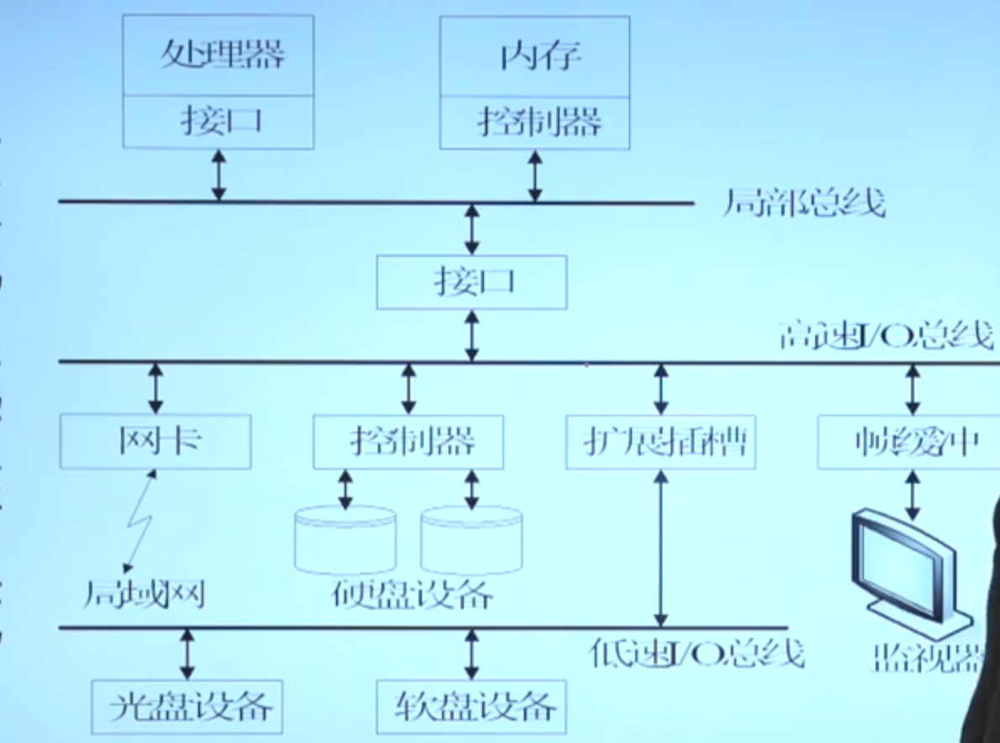
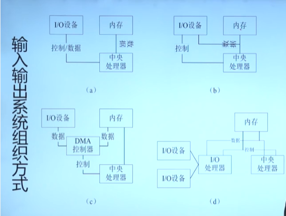
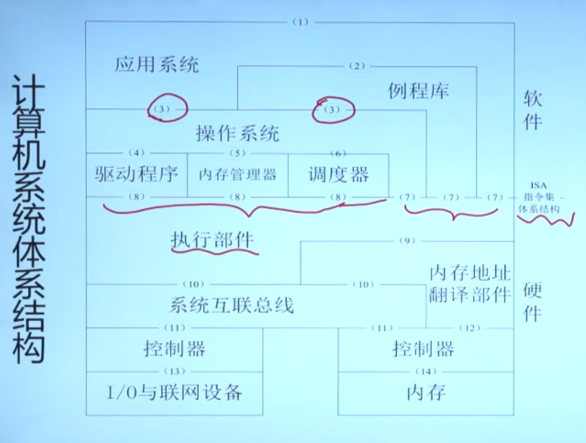
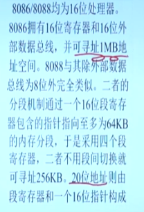

# 计算机系统硬件组成

## 内存系统
1. 主存（Main Memories）
    - RAM（只读存贮器） & ROM（随机访问存储器）
    - 实际地址空间
        - 物理地址空间，按照字节编址 Bytes
        - RAM & ROM
        - 保留用于其他设备或以后他用
2. 高速缓冲（Cache Memories）
    - [JAVA 拾遗 — CPU Cache 与缓存行](https://www.cnkirito.moe/cache-line/)
    - 因内存寻址访问效率和**局部性原理**引入
    - 有硬件管理，对软件不可见
    - 怎样对高速缓冲的数据进行淘汰，怎么保证高速缓冲中的数据是最容易访问到的数据。

## 输入输出系统组织方式

## 计算机系统体系结构

## 操作系统对其他设施的管控
1. 对外围设备，通过端口
2. 对于内存，通过地址机制
3. 对于 处理器，指令集

# 用户指令集体系结构

## 用户指令集体系结构 User ISA
- 寄存器架构
    - 通用寄存器，特定类型寄存器（如浮点数）
    - 专用寄存器（PC，链接/栈指针/条件码/循环计数寄存器）
- 内存架构
    - 逻辑/虚拟地址空间
        - 线性编址 0x0000 0000、0x8000 0000、0xFFFF FFFF（4G）
        - 分段编址 0# ~ 15# 分段基址 - 段寄存器值（段号+offset）
- 用户指令 —— 运算型
    - 内存存取指令、分支跳转指令
    - 整数算数、逻辑以及位移指令
    - 浮点指令

## 内存管理模型实地址模型
能寻址多大的内存，主要取决于地址线的数量
16位寄存器和16位地址线，理论上可以寻找2^16 = 64KB的内存地址。

## 内存管理模型 平坦模型/分段模型
还是线性编址和分段编址的意思。
线性地址空间支持分页！我大概懂了，学了高层的东西再去学底层的东西，联系起来的感觉太好了。

### 关于 0xFFFF FFFF 4G解释
先说原因，CPU 的基本单位是字节。
32位的操作系统理论上最多支持4GBytes是没问题的。
1Bytes（字节）=8bits(字位)也是没问题的。你存在概念性错误，你的计算方案应该是以 CPU 的32位数来计算就只有2^32bits= 512MByte，然而2^32Byte=4GB。
首先你要区分32位操作系统和32位的处理器（cpu）的区别和联系。
（一）32位CPU每次可以处理32个字位，也就是四个字节。每一个字节都有一个地址，其中包含了8个字位。32位CPU有32条地址线，地址线决定了寻址范围的能力。每一根线都决定0和1两个地址，那么两根线就会决定00，01，10,11这四个地址，依次类推，32根线总共会决定出2^32次方个位置。这样计算是没有问题的。每一个位置都是1Byte,这是内存的基本单位，所以32位操作系统配32位CPU，理论上可以寻找4GB的地址。由于硬件等原因，系统显示会不到4G。
（二）32位操作系统与64位CPU的搭配。64位CPU有64根地址总线，理论支持2^32/1024^3 G的内存，这是一个很大的数字，但是实际上我们市场的电脑目前远远达不到这个理论内存的万分之一。目前64位也就是能支持120G的内存。但是如果64位CPU和32位操作系统搭配，也仅仅会支持4G的内存。因为在32位系统下，仅有32根地址线工作。
（三）寻址范围是由地址线个数确定的，而不是CPU位数确定的。CPU的地址总线根数决定了能找到多少个字节(Byte)，数据总线的宽度决定了能够一次传送多少个二进制位(bit) 。希望你能明白其中的关系，不要把地址线直接和字位（bit)联系在一起。

# 系统指令集体系结构以及陷入机制